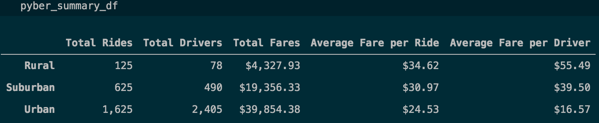
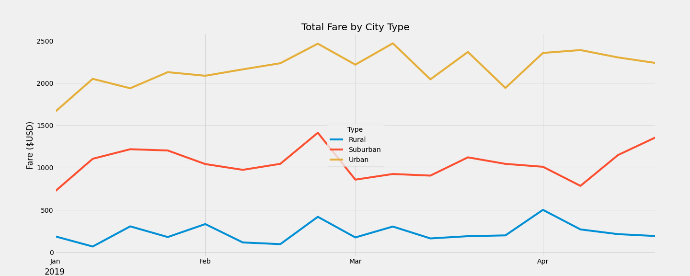

# PyBer_Analysis
## Overview of the analysis
The analysis of Pyber ride-sharing delivers the result of total fares, drivers, rides and the average per ride and average per driver among urban, suburban and rural cities. Graphs are provided to visualize the analysis result. At the end of the analysis, recommendations are given for the CEO to review for business improvement - aiming to increase the company's revenue.

## Results:
### Result from Pyber Summary Dataframe
---
From the Pyber Summary Dataframe as shown below, total rides, drivers, and fares are having the highest numbers in urban cities. However the highest average fare per ride and per driver is in rural cities where the number of rides and drivers are the lowest among all three city types. See below for a detailed analysis on the disparities drawn from the table with the ride-sharing data among different city types:

1. There are 1,625 total rides in urban cities. The number of total rides in urban cities is 2.6 times than suburban area total rides, and is 13 times than the total rides in rural cities.

2. Total drivers in urban cities are far surpassing the number of drivers in suburban and rural cities. There are 2,405, 490, and 78 number of drivers respectively for urban, suburban and rural cities collected for the analysis.

3. Urban total fares are more than 9 times compared to the rural total fares, while suburban total fares is sitting in the middle between urban and rural cities.

4. Average fare per ride in rural cities is $34.62, whereas suburban and urban average fare per ride is lower at $30.97 and $24.53 based on the analysis.

5. Average fare per driver follow the similar trajectory of the fare per ride: in rural cities, it has the highest amount of $55.49 per driver. And in suburban cities, it has the amount of $39.50 average fare per driver. The lowest average fare per driver is in urban cities, with the amount of $16.57.

### Result from Multi-line Chart
---
From the chart below, we can visualize our analysis from the pyber summary dataframe. The yellow line on the top representing the urban city type data, it's reflecting the highest total fare consistently among all city types throughout our time period selected (2019 January to mid April). The red line has a relatively lower amount of total fare and it fluctuates during the months from Jan to April in 2019. The blue line, sitting at the bottom, has the lowest total fare among all city types. 

With the multi-line chart below, the trend and differences can be seen more clearly of the three types of city on their ride-sharing data.

## Summary: 
Based on the analysis and the result, here are some recommendations for the CEO to consider for the next steps addressing the disparities among urban, suburban and rural areas.

* Create incentives for both drivers and customers, for example, discounts on shorter distance rides, in the rural cities to encourage more rides.

* For suburban cities, rearrange driver distributions based on the demand due to the fluctuations on the total fare through Jan to April in 2019. Encourage more drivers during the "peak weeks".

* For urban cities, have peak hour price raised to maintain or increase the revenue to take advantage of the consistent high demand.